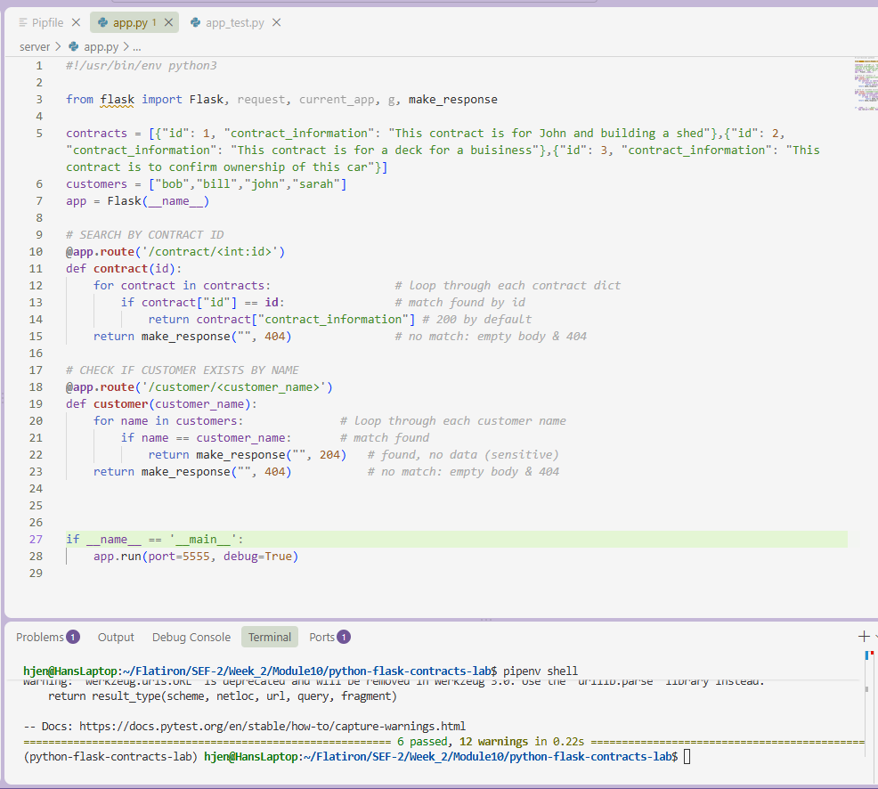

# Lab: Routes Request Response Cycle - Managing Contracts

**Completed Sept 14, 2026**

A small Flask API that manages contract and customer records for a company handling contracts between two parties. Customer data is treated as sensitive and is never returned in a response body (only its existence is confirmed).

## Screenshot



## Routes

### `GET /contract/<id>`

Looks up a contract by its integer ID.

- **200** → Contract found. Returns the contract's `contract_information` as plain text.
- **404** → No contract with that ID exists. Empty body.

### `GET /customer/<customer_name>`

Checks whether a customer exists by name, without exposing any customer data.

- **204** → Customer found. Empty body (data is sensitive and intentionally withheld).
- **404** → No customer with that name exists. Empty body.

## Setup

1. Fork and clone this repository.
2. Open the project in your editor of choice.
3. Install dependencies:
```bash
   pipenv install
```
4. Activate the virtual environment:
```bash
   pipenv shell
```
5. Run the app:
```bash
   python server/app.py
```
   The server runs on `http://localhost:5555`.

## Testing

Run the test suite from the `server/` directory:

```bash
pytest
```

All six tests cover both routes' success and failure cases.

## Notes

- Customer information is intentionally excluded from all responses per the sensitive-data handling requirement — only a status code confirms existence.